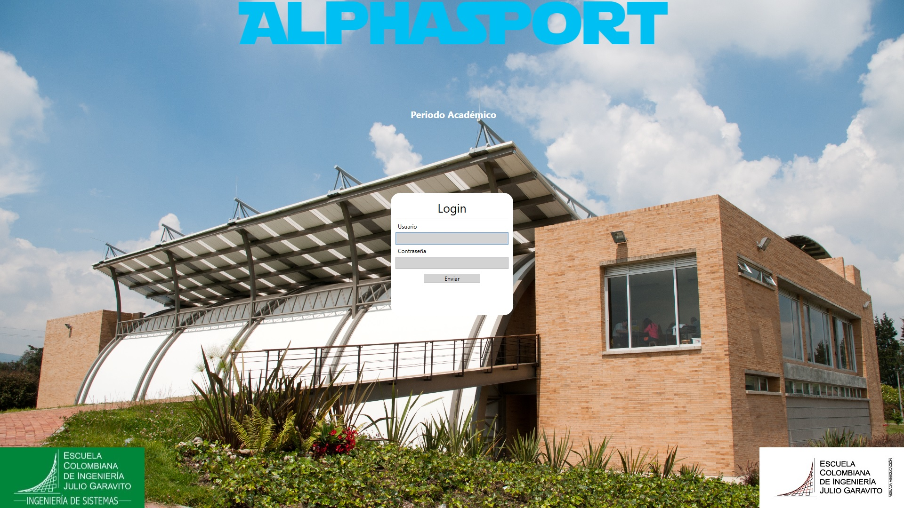

# Proyecto de Grado 2018-2019
# Sistema de Gestión y Registro del Gimnasio de la Escuela
 
El proyecto fue desarrollado para mejorar el actual proceso mediante el desarrollo de una herramienta informática que permite realizar procesos de registro y seguimiento de horarios a los usuarios de un gimnasio deportivo, y procesos de gestión administrativa de recursos y servicios a los administradores del mismo.

## Epic-Sport-_Deportes

### .NET Framework 4.6.1 - WPF Application

Aplicación de escritorio para Windows en WPF (Windows Platform Foundation)

Para importar proyecto primero instale el certificado .kys
Luego pruebe la conexión con MYSQLconnect for Visual Studio

## Certificado de Prueba

Plataforma: x64  
Emisor: DESKTOP-TOP/manue  
Ruta: /  
Clave: deportes20182  
Tipo: Certificado de pruebas  
Cifrado: SHA256RSA  
Valido: de 30/09/2018 a 1/10/2019  

### PRIMERO INSTALAR EL CERTIFICADO DESDE EL MENÚ DE CERTIFICADOS EN LA OPCIÓN DE PROPIEDADES DE VISUAL STUDIO 2017
